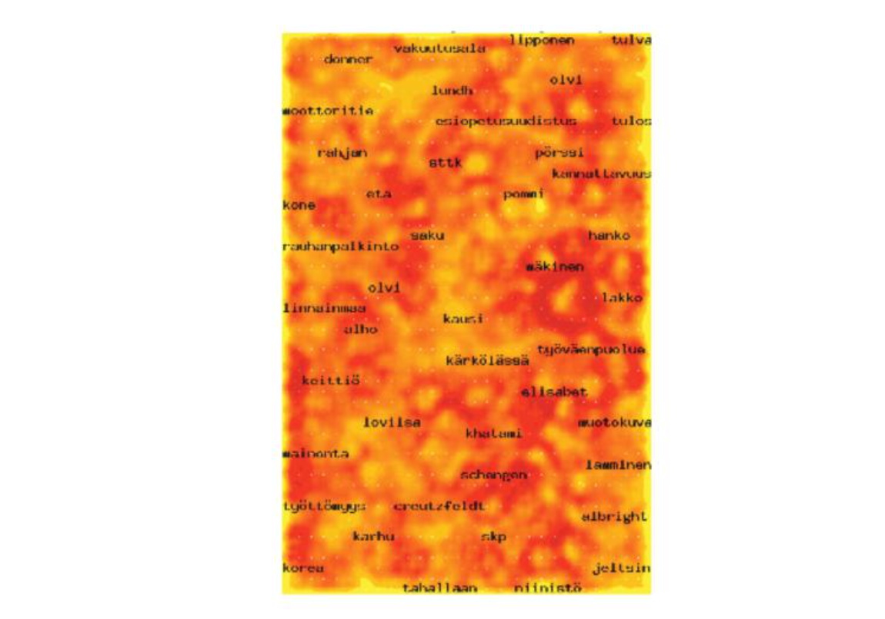

#Визуализация текстов и документов
В наше время мы имеем огромное количество источников информации: от библиотек до электронной почты, а также различных веб-приложений.
Визуализация – отличный способ проанализировать подобную информацию. При помощи различных подходов мы можем визуализуализировать такие вещи, как блог, вики-страницы, лента в Твиттере, миллиарды слов, набор бумаг или электронную библиотеку. Так как способ визуализации данных зависит от задачи, которую мы решаем, нам необходимо понимать, какая именно информация нам потребуется при работе с текстом, документами или некоторыми интернет-сущностями. Наиболее очивидной задачей, сопряженной с анализом тектов и документов, очивидно, является поиск слова, фразы или темы. В слабо структурированных данных мы моглибы искать связи между словами, фразами, темами или документами. Для структорированных массивов тектов или документов основной задачей часто является поиск паттернов и выбросов.
В этой статье мы обратим внимание на задачи, связанные с текстами и на различные подходы их визуализации с целью проведения определенного визуального анализа.

##1. Введение
Определим [множественный] **корпус**, как некоторый набор (коллекция) документов. Мы взаимодействуем с объектами этого корпуса. Такими объектами могут быть слова, предложения, абзацы, цельные документы. Также мы можем рассматривать иллюстрации и видео. Чаще всего эти объекты рассматриваются поотдельности, в зависимости от типа задачи. Тексты и документы часто минимально структурированны и могут содержать определенные атрибуты, метаданные, особенно если эти тексты относятся к какой-то специфической предметной области. К примеру, документы имеют формат и часто включаютс в себя информацию об этом документе (автор, дата создания, дата изменения, комментарии, размер и др.). Для того, чтобы делать запросы к корпусу используются специальные системы извлечения информации, которые позволяют понять, насколько каждый из документов релевантен запросу. Для этого необходимо производить некоторые предварительные вычисления, а также интерпретировать семантику текстов.

Также мы имеем возможность подсчитывать статистики по документам. Например, число слов в абзацах или распределение слов по частотам, относительно авторов текстов. Есть ли в тексте какие-то абзацы, в которых повторяется одно и то же слово или предложение? Также мы имеем возможность строить связи между абзацами документов внутри корпуса. Например кто-то спросит: "В каких документах говорится о распространении гриппа?". Это не самый простой запрос – это не просто взять и поискать слова "грипп". Почему? Далее можно искать естественные связи или отношения между различными документами. Какие кластеры тут наблюдаются? Являются ли эти кластеры темами? Похожесть может быть определена в терминах цитирования, обзего авторства, тематики и т.д.

##2. Уровни представления текстов
Выделим три уровня представления текстов: лексический, синтаксический и семантический. Каждый из них требует от нас конвертации неструктурированных тектов в некоторую форму структурированных данных.

- **Лексический уровень.** Лексический уровень основан на преобразовании наборов символов (строк) в последовательность атомарных сущностей, называемых **токенами**. Лексический анализаторы преобразуют входную последовательность символов по данным наборам правил в новые последовательности токенов, которые могут быть использованы в дальнейшем анализе. Токены мокут в ключать в себя символы. n-граммы, слова, основы слов, лесемы, фразы или словесные n-грамы, все с присущими им атрибутами. Много правил может быть использовано для извленчения токенов, наиболее распростронееым из них является конечный автомат, определенные некоторым регулярным выражением.
- **Синтаксический уровень.** Синтаксический уровень определяет и теггирует (аннотирует) функцию каждого токена. Мы присваиваем различные теги, такие как позиция в предложении или является ли слово существительным, прилагательным, бранным словом, модификатором или союзом. Токен также может иметь атрибуты, которые говорят о том, стоит ли он в единственном числе, а таеже определяют близость токена к другим токенам. Расширенные теги могут определять дату, валюту, место, персоналию, орагизацию и время. (Рис. 3) Процесс извдечения подобных аннотаций называется Распознованием Именнованных Сущностей (named entity recognition – NER). Богатство и разнообразие лингвистических моделей ведет к широкому разнообразию подходов.
- **Семантический уровень.** Семантический уровень включает в себя извлечение смысла и связей между знаниями, полученными на этапе определения структуры на синтаксическом уровне. Цель этого уровня – опрпделить аналитическую интерпретацию текста целиком в рамках определенного контекста или даже вне зависимости от контекста.

##3. Модель векторного пространства
Для различных техник визуализации и анализа документов и корпусов вычисление векторов теромов является важнейшим шагом. В модели векторного пространства **вектор термов** интересующего нас объекта (абзаца, документа или целого набора документов) – это вектор, в котором каждая координата отрадает вес данного слова в конкретном документе. Обычно для очистки от шумов учитываются и фильтруются стоп-слова (такие, как "the" и "a"), а также слова, у которых происходит склеивание основы.
Приведенный ниже псевдокод подсчитывает появления уникальных токенов за исключением стоп-слов. Подразумевается, что на взод подается поток токенов, сгенерированных лексическим анализатором для единиченого докумета. В переменной term лежит хэш-таблица, которая хранит для каждоко терма число его появления в документе.

	COUNT-TERMS(tokenStream)
	1 terms ← ∅ // инициализируем terms пустой хэш-таблицкй.
	initialize terms to an empty hashtable. 
	2 for each token t in tokenStream
	3 	do if tisnotastopword
	4 		do increment (or initialize to 1) terms[t]
	5 return terms

Можем применить этот псевдокод к следующему тексту:

	There is a great deal of controversy about the safety of genetically engineered foods. Advocates of biotechnology often say that the risks are overblown.
	"There have been 25,000 trials of genetically modified crops in the world, now, and not a single incident, or anything dangerous in these releases," said a spokesman for Adventa Holdings, a UK biotech firm. During the 2000 presidential campaign, then-candidate George W. Bush said that "study after study has shown no evidence of danger." And Clinton Administration Agriculture Secretary Dan Glickman said that "test after rigorous scientific test" had proven the safety of genetically engineered products.

Абзац содержит 98 токенов, 74 терма и 48 термов после удаления стоп-слов.
В таблицы показаны результаты работы псевдокода:

genetically|said|safety|engineered|study|test|great|deal|controversy|foods
---|---|---|---|---|---|---|---|---|---
3|3|2|2|2|2|1|1|1|1

###3.1. Подсчет весов
Эта модель векторного пространства требует наличия у термов документа определенных весов. Существует множество методов для подсчета весов, наиболее известным из которыз яляется frequency inverse document frequency (tf-idf). Пусть *Tf(w)* - частота терма или количество раз, которые слово w встретилось в документе. Пусть также *Df(w)* – количество документов, содержащих данное слово. Также пусть *N* - число документов. Тогда определим *TfIdf(w)* как 

По сути, это есть относительная важность слова в документе, что отражет нашу интуитивное понимание важности слова. Слово тем более важно, чем в меньшем количестве документов оно встречается (наименьшее *Df*), а также, если оно  встречается в определенном документе несколько раз (наибольшее *Tf*). Говоря иначе, мы нам наиболее интересны слова, которые часто встречаются в каком-то конкретном документе, но при этом редко во всем корпусе в целом. Такие слова интуитивно болле важны, так как при помощи них можно разделять и классифицировать документы. На рис.1 показаны вектора термов для группы документов с использованием *tf-idf* весов.

**Рис.1.** Иллюстрация векторов термов для множества документов, содержащие значения *tf-idf*

Следующий псевдокод вычисляет *tf-idf* вектора для каждого документа в данной коллекции документов. Он использует функцию Count-Terms в предыдущем примере. Первая секция итерируется по всем документам, вычисляя и сохраняя Tf и Df. Во второй секции происходит вычисление *tf-idf* векторов для каждого документа и сохранение в таблицу.

	Compute-TfIdf(documents)
	1 termFrequencies ← ∅ // Ищем частоты
	2 documentFrequencies ← ∅ // Подсчитываем документы, в которых терм был встречен
	3 uniqueTerms ← ∅ // Список всех уникальных термов
	4 for each document d in documents
	5 		do docName ← Name(d) // Извлекаем имя документа
	6		tokenStream ← Tokenize(d) // Генерируем поток токенов документа
	7 		terms ← Count-Terms(tokenStream) // Подчитываем Tf
	8		termFrequencies[docName] ← terms // Сохраняем Tf
	9		for each term t in Keys(terms)
	10			do increment (or initialize to 1) documentFrequencies[t]
	11			uniqueTerms ← uniqueTerms ∪ t
	12
	13 tfIdfVectorTable ← ∅ // Подсчитывает tf-idf
	14 n ← Length(documents)
	15 for each document name docName in Keys(termFrequencies)
	16 		do tfIdfVector ← create zeroed array of length Length(uniqueTerms)  
	17			terms ← termFrequencies[docName]
	18			for each term t in keys(terms)
	19				do tf ← terms[t]
	20					df ← documentFrequencies[t]
	21					tfIdf ← tf ∗ log(n/df)
	22					tfIdfVector[index of t in uniqueTerms] ← tfIdf
	23			tfIdfVectorTable[docName] ← tfIdfVector
	24	return tfIdfVectorTable

###3.2. Закон Ципфа
Мы лучше всего знакомы с нормальным и равномерным распределениями. Когда мы работаем с большими объемами данных, очень часто сталкиваемся с экспоненциальным распределением, которое отражает феномен масштаба. Экономист В. Парето утверждал, что выручка компании обратнопропорционально его экспоненциальному распределению – классическому закону 80-20, который определяет, что 20% населения обладает 80% богатств.

**Рис.2.** Распределение термов в Википедии, наглядный пример закона Ципфа. По оси Oy – значение частоты, по Ox – позиция в рейтенге частот.

Лингвист из Гарварда Джордж Кинсли Ципф определил распределение слов в естественном языке с помощью дискретного экспоненциального распределения, окторое назвали распределением Ципфа. Закон Ципфа утверждает, что в обычном документе на естественном языкечастота любого слова обратнопропорциональна его месту в таблице частот. Строя кривую распределения Ципфа в масштабе log-log, получаем прямую линию с уклоном около -1 (см. Рис. 2)
Самый простой вывод из закона Ципфа состоит в том, что в небольших документов ключевые идеи описываются малым числом слов. Есть множество примеров текстов, смысл которых можно лаконично передеть несколькими словами.

###3.3 Примеры задач, решаемых при помощи модели векторного пространства

Модель векторного пространства в связке с некоторыми метриками расстояния позволяет решить много полезных задач. Мы можем использовать tf-idf и модель векторного пространства для поиска документов, отвечающих нашим интересам.

**Рис.3.** Пример документа, в котором выделены именованные сущности. Цвета означают тип сущности.

Например, модель вкупе с некоторыми метриками расстояния позволяет нам отвечть на такие вопросы, как "похож ли этот документ на тот", "какие документы наиболее релевантны поисковому запросу" – все пр ипрмощи нахождения документов, векторы термов которых наиболее похоже на вектор входного документа, среднего вектора коллкеции или вектору поискового запроса.

Другой косвенной задачей может стать помощь пользователю понять весь корпус. Пользователь может искать паттерны или структуры, такие как основные тематики или кластеры, а таеже распределение тем по коллекции документов. Часто это включает в себя визуализаию корпуса на плоскости или отображение графа связей между документами или сущностями. В целом визуализация выглядит примерно так: мы получаем данные (корпус), превращаем его в набор векторов, затем запускаем алгоритм, который будет решать нужную задачу (например, кластеризация или поиск схожих текстов), а затем генерируем какую-то визуальную картину.

##4. Визуализация отдельных документов
Здесь мы покажем несколько способов визуализации единичного тектового документа, взятых с VAST Contest 2007.

**Рис.4.** Облако тегов, созданное при помощи сервиса tagCrowd.com. Размер шрифта и насыщенность цвета прямопропорциональны частоте слова в документе.

### 4.1 Облако из слов (Word Cloud)
Облака слов (Рис. 4), также известные, как облака тегов – это специальным образом расположенные линии из токенов. Цвет и размер отражает частоту встречаемости токена в документе. Такие облака и их вариации, такие как Wordle (Рис. 5) – примеры визуализаций, которые используют только частотныые вектора и определенные алгоритм размещения для создания визуализации.

**Рис.5.** Пример облачной визуализации, созданной при помощи сервиса wordle.net. Размер текста соответствует частоте слова в документе.

### 4.2 Словесное дерево (WordTree)
Словесное дерево – способ визуализации частот, а также контекста (Рис. 6). Размер используется для отображеня частоты встречаемости терма или фразы. Корень дерева определяется пользователем и является словом или фразой, которая представляет наибольший интерес, а ветки представляют собой различные вариации контекстов, в которых используется данное слово или фраза.

**Рис.6.** Визуализация словесного дерева, созданная при помощи сервиса ManyEyes. Ветки дерева представляют собой различные вариации контекстов, в которых используется слово или фраза, находящаяся в корне.

### 4.3 Текстовая арка (TextArc)
Можно расширить представление распределения слов при помощи отображения связей между ними. Есть несколько способов, которые позволяют рассчитать эти связи. Текстовая арка – визуальное отображение того, как термы отнозятся к строкам текста, в которых они встречаются (Рис. 7). Каждое слово из текста рисуется по порядку вокруг эллипса в виде тонких диний с небольшим отступом от начала. Также, как и в облаке тегов наимболее часто встречаемые слова рисуются крупнее и ярче, Слова с наибольшими частотами помещаются внутрь эллипса. Пользователь может подсветить текст и проанимировать "чтение" текста, последовательно подсвечивая слова, встречающиеся в тексте.

**Рис.7.** Визаулизация в виде текстовой арки полного текста "Алисы в стране Чудес".

### 4.4 Диаграммы в виде арки (Arc diagrams)

Диаграммы в виде арок  – отображают повторяющиеся последовательности в тексте. 
Повторяющиеся подпоследовательности соединены полукруглыми арками. Толщина арки показывает длину подпоследовательности, а высота арки – расстояние между последовательностями. На Рис. 8 отображен Минуэт Соль-мажор Баха – классический пример минуэта. Он состоит из двух основных частей. Пересечение двух основных арок показывает, что конец первой части содержится в начале второй.

**Рис.8.** Диаграмма в виде арок, визуализирующая Минуэт Соль-мажор Баха.

### 4.5 Литературный отпечаток (Literature fingerprinting)
Литературный отпечаток – метод визуализации признаков, который используется для получения характеристике текста. Всесто того, чтобы считать вектор только для одного признака, мы считаем последователность признаков в тексте и показываем их пользователю, как характеристические "отпечатки" документа. Это позволяет пользователю "заглянуть" в документ и проанализировать значения. Более того, структурная информация, полученная из документа используется для визуализации документа на разных уровнях. Литературный отпечаток был применен для демонстрации несостоятельности стандартных подходов к анализу авторства и стиля произведения (см. Рис. 9).

**Рис.9.** Техника Литературного отпечатка

##5. Визуализация коллекции докумунтов
В большинстве задач по визуализации массива документов требуется разместить похожие документы максимально близко друг к другу, а отличающиеся – достаточно далеко. Это есть задача на Минимакс, обычно ее решение занимает O(n2). Суть в том, что мы рассчитываем сходство между всми частями документов и располагаем их определенным образом в пространстве (на плоскости). Наиболее распространеннымм способами отображения являются графы, многомерное масштабирование, кластеризация, самоорганизующиеся карты (self-organizing maps), карты кластеров и тематические пейзажи (themescapes);

### 5.1. Самоорганизующиеся карты (Self-Organizing Maps)
Самоорганизующиеся карты – алгоритм машинного обучения без учителя, который использует 2D-ноды, в которых находятся документы. Каждая нода связана с вектором той же размерности, что и входной вектор (векторы документов), эти векторы нод испотльзубтся для обучения. Обычно эти ноды инициализируются со случайными весами. Мы выбираем соучайный вектор из входных векторов и рассчитываем расстояние до каждой ноды. Далее мы выбираем наиболее близкую ноду (с наименьшим радиусом) и подгоняем ее веса делая их наиболее похожими на входной вектор. Итерируясь по входным векторам мы делаем радиусы меньше. Пример использования этого подхода показан на Рис. 10. На нем изображен миллион документов, распределенный по 83 новостным группам.

**Рис.10.** Пример использования самоорганизующейся карты на основе финских новостных брошюр. 

### 5.2. Тематические пейзажи (Themescapes)
Тематические пейзажи – по сути резюме всего корпуса, выглядит как 3D-пейзаж, в котором высоты и цвета используются для передачи полотности похожих документов. На примере, приведенном на Рис. 11 из Pacific Northwest National Labs показаны новостные статьи в виде тематического пейзажа. Высокие "горы" представляют собой популярные темы корпуса (высота пропорциональна числу документов на эту тему)

**Рис.11.** Пример тематического пейзажа.

### 5.3. Карточки документов (Document Cards)
Карточки документов – это способ компактной визаулизации (Рис. 12), который позволяет отразить ключевые семантические признаки документов в виде набора картинок и важных ключевых терминов.
Изображения и их заголовки извлекаются при помощи графических эвристик, также заголовки используются в поусемантическом взвешивании изображений. К тому же, цветовая гистограмма изображения используется для классификации изображениям (фотография/график/набросок/таблицы). После чего полученные классы испотзуются для отображения.

**Рис.12.** Карточки документов

##6. Расширенная визуализация текстов
Далее рассмотрим несколько способов визуализации тектовых данных, которые используют мета-данные или иначе говоря, идут чуть дальше, чем обычные способы, основанные на векторах.

### 6.1. Визуализация ПО (Software Visualization)
Eick et al. разработал инструмент визуализации под названием SeeSoft, который позволяет отображать статистику для каждой строки кода (например, возраст и количество модификаций, программиста, даты). На Рис. 13 каждая колонка представляет собой файл исходного кода, высота колонки отражает размер файла. Если файл длиннее экрана, то колонка переходит в следующую. В классическом варианте SeeSoft отобраажает каждую строку кода в линию. Как только количество строк становится так велико, что уже не влезает в строку, каждая строка отображается как пиксель. Таким образом можно отобразить достаточно большое число строк. Цвет используется для отражения числа вызовов. Чем чаще строка кода вызывается, тем краснее ее цвет. Голубые линии – редко вызываемые; Цвет может быть использован и для отражения других параметров, таких как время последнего изменения. Испульзуя область с разрешением 1000х1000 SeeSoft отображает до 50 000 строк кода. Этот рисунок содержит визуализацию 52 файлов и 15 255 строк кода. Выбранный файл file1.c - увеличенный вариант.

**Рис.13.** Пример документа, в котором выделены именованные сущности. Цвета означают тип сущности.

### 6.2. Визуализация результатов поискового запроса
Марти Херст (Marti Hearst) разработал очень удобный и простой способ визуализации поисковых запросов. Он очень похож на пиксельное отображение Кейма (Keim), которое называется TileBars. Оно отображает статсистики по термам, включая частоты и распределения, длины документов и др. Каждый документ отображается в в виде прямоугольника, где ширина означает относительную длину документа, а сложенные прямоугольники относятся к сегментам текста (см. Рис.14).
Каждый боьлшой прямоугольник означает документ, каждый квадратик внутри прямоугольника - отрывок текста. Каждая строка стопки отражает набор запрошенных термов, а степень закрашенности квадратика - частоту встречаемости терма.

**Рис.14.** Визуализация исходного исходного кода при помощи SeeSoft.

### 6.3. Визуализация изменяющихся коллекций документов
Река Времени (TimeRiver), также называемая потоковым графом – способ визуализировать изменения тематик внутри корпуса с течением времени (Рис.15). Предполагается, что документы корпуса меняются с течением времени. Визуально тематики отображены в виде горизонтально ориентированных лент, толщина которых в определенном месте означает встречаемость темы в определенный момент времени. 

**Рис.15.** TimeRiver

*Jigsaw* – инструмент для визуализации и анализа текстовых корпусов. Календарь Jigsaw располагает документы на плоскости на основе того, когда определенные сущности появились в тексте. Когда пользователь выбирает документ, отображаются сущности, встречающиеся в этом документе. (Рис.16)

**Рис.16.** Jigwaw Calendar View

### 6.4. Отображение связей

Jigsaw также включаетс в себя и возможность отображения сущностей в виде графа (Рис. 18), с помощью которого пользователь имеет возможность исследовать связонные сущности из документов. Такой инструмент не отображает всю коллекцию документов целиком, но он позволяет итеративно выбирать нужные документы и исследовать корпус (Рис. 19).

**Рис.17.** Визуализация сентимент-анализа.

**Рис.18.** Jigsaw graph view – показывает связи между документами.

**Рис.19.** Кластеризация документов

The Jigsaw list view – альтернативный графу способ представлени документов, который позволяет пользователю исследовать связи между различными типами сущностей. На Рис.20 показан пример того, как пользователь может изучать интересующие его объекты.

**Рис.20.** Jigsaw list view, показывающий связи между людьми (слева), местами (в центре) и организациями (справа).

##7. Заключение
В данной статье мы рассмотрели фундаментальные подходы к обработке неструктурированных текстовых данных в структурные данные, пригодные для визуализации и дальнейшего анализа. Мы показали визуальзацию в виде облака слов, словесных деревьев и и способы выявления тематик конкретного документа. Такие способы визуализации, как самоорганизующиеся карты, карты отображения и тематические пейзажи очень полезны для визуализации коллекции документов в целом. Для глубокого анализа корпуса со сложными связями и временными характеристиками мы кратко рассмотрели некоторые способы визуализации, такие как графы, ThemeRiver и календарь.

