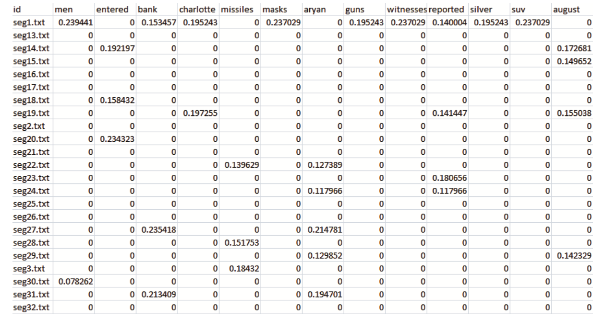
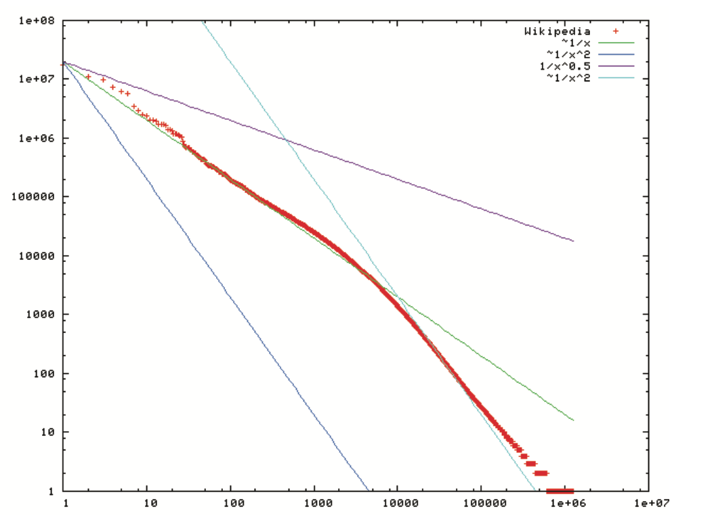
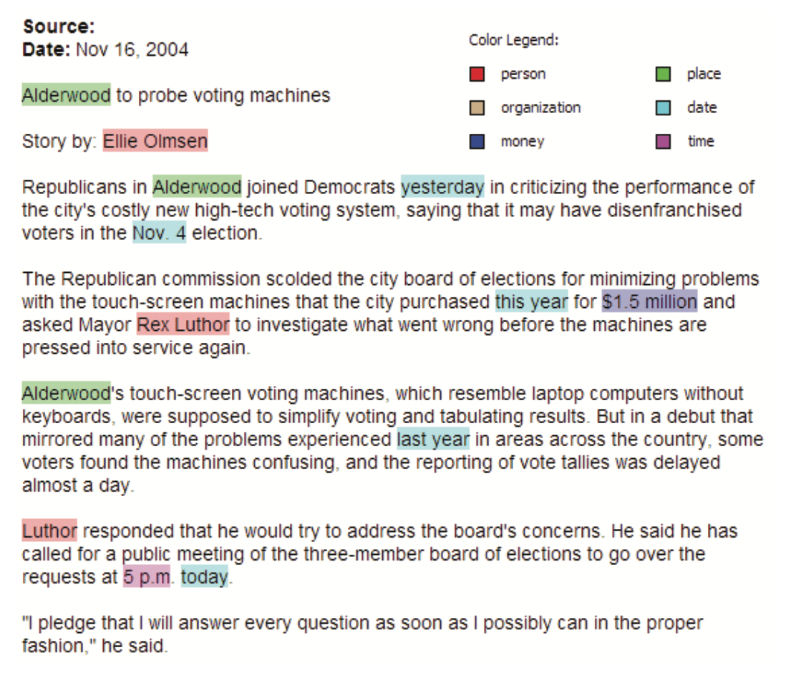

#Визуализация текстов и документов
В наше время мы имеем огромное количество источников информации: от библиотек до электронной почты, а также различных веб-приложений.
Визуализация – отличный способ проанализировать подобную информацию. При помощи различных подходов мы можем визуализуализировать такие вещи, как блог, вики-страницы, лента в Твиттере, миллиарды слов, набор бумаг или электронную библиотеку. Так как способ визуализации данных зависит от задачи, которую мы решаем, нам необходимо понимать, какая именно информация нам потребуется при работе с текстом, документами или некоторыми интернет-сущностями. Наиболее очивидной задачей, сопряженной с анализом тектов и документов, очивидно, является поиск слова, фразы или темы. В слабо структурированных данных мы моглибы искать связи между словами, фразами, темами или документами. Для структорированных массивов тектов или документов основной задачей часто является поиск паттернов и выбросов.
В этой статье мы обратим внимание на задачи, связанные с текстами и на различные подходы их визуализации с целью проведения определенного визуального анализа.

##1. Введение
Определим [множественный] **корпус**, как некоторый набор (коллекция) документов. Мы взаимодействуем с объектами этого корпуса. Такими объектами могут быть слова, предложения, абзацы, цельные документы. Также мы можем рассматривать иллюстрации и видео. Чаще всего эти объекты рассматриваются поотдельности, в зависимости от типа задачи. Тексты и документы часто минимально структурированны и могут содержать определенные атрибуты, метаданные, особенно если эти тексты относятся к какой-то специфической предметной области. К примеру, документы имеют формат и часто включаютс в себя информацию об этом документе (автор, дата создания, дата изменения, комментарии, размер и др.). Для того, чтобы делать запросы к корпусу используются специальные системы извлечения информации, которые позволяют понять, насколько каждый из документов релевантен запросу. Для этого необходимо производить некоторые предварительные вычисления, а также интерпретировать семантику текстов.

Также мы имеем возможность подсчитывать статистики по документам. Например, число слов в абзацах или распределение слов по частотам, относительно авторов текстов. Есть ли в тексте какие-то абзацы, в которых повторяется одно и то же слово или предложение? Также мы имеем возможность строить связи между абзацами документов внутри корпуса. Например кто-то спросит: "В каких документах говорится о распространении гриппа?". Это не самый простой запрос – это не просто взять и поискать слова "грипп". Почему? Далее можно искать естественные связи или отношения между различными документами. Какие кластеры тут наблюдаются? Являются ли эти кластеры темами? Похожесть может быть определена в терминах цитирования, обзего авторства, тематики и т.д.

##2. Уровни представления текстов
Выделим три уровня представления текстов: лексический, синтаксический и семантический. Каждый из них требует от нас конвертации неструктурированных тектов в некоторую форму структурированных данных.

- **Лексический уровень.** Лексический уровень основан на преобразовании наборов символов (строк) в последовательность атомарных сущностей, называемых **токенами**. Лексический анализаторы преобразуют входную последовательность символов по данным наборам правил в новые последовательности токенов, которые могут быть использованы в дальнейшем анализе. Токены мокут в ключать в себя символы. n-граммы, слова, основы слов, лесемы, фразы или словесные n-грамы, все с присущими им атрибутами. Много правил может быть использовано для извленчения токенов, наиболее распростронееым из них является конечный автомат, определенные некоторым регулярным выражением.
- **Синтаксический уровень.** Синтаксический уровень определяет и теггирует (аннотирует) функцию каждого токена. Мы присваиваем различные теги, такие как позиция в предложении или является ли слово существительным, прилагательным, бранным словом, модификатором или союзом. Токен также может иметь атрибуты, которые говорят о том, стоит ли он в единственном числе, а таеже определяют близость токена к другим токенам. Расширенные теги могут определять дату, валюту, место, персоналию, орагизацию и время. (Рис. 3) Процесс извдечения подобных аннотаций называется Распознованием Именнованных Сущностей (named entity recognition – NER). Богатство и разнообразие лингвистических моделей ведет к широкому разнообразию подходов.
- **Семантический уровень.** Семантический уровень включает в себя извлечение смысла и связей между знаниями, полученными на этапе определения структуры на синтаксическом уровне. Цель этого уровня – опрпделить аналитическую интерпретацию текста целиком в рамках определенного контекста или даже вне зависимости от контекста.

##3. Модель векторного пространства
Для различных техник визуализации и анализа документов и корпусов вычисление векторов теромов является важнейшим шагом. В модели векторного пространства **вектор термов** интересующего нас объекта (абзаца, документа или целого набора документов) – это вектор, в котором каждая координата отрадает вес данного слова в конкретном документе. Обычно для очистки от шумов учитываются и фильтруются стоп-слова (такие, как "the" и "a"), а также слова, у которых происходит склеивание основы.
Приведенный ниже псевдокод подсчитывает появления уникальных токенов за исключением стоп-слов. Подразумевается, что на взод подается поток токенов, сгенерированных лексическим анализатором для единиченого докумета. В переменной term лежит хэш-таблица, которая хранит для каждоко терма число его появления в документе.

	COUNT-TERMS(tokenStream)
	1 terms ← ∅ // инициализируем terms пустой хэш-таблицкй.
	initialize terms to an empty hashtable. 
	2 for each token t in tokenStream
	3 	do if tisnotastopword
	4 		do increment (or initialize to 1) terms[t]
	5 return terms

Можем применить этот псевдокод к следующему тексту:

	There is a great deal of controversy about the safety of genetically engineered foods. Advocates of biotechnology often say that the risks are overblown.
	"There have been 25,000 trials of genetically modified crops in the world, now, and not a single incident, or anything dangerous in these releases," said a spokesman for Adventa Holdings, a UK biotech firm. During the 2000 presidential campaign, then-candidate George W. Bush said that "study after study has shown no evidence of danger." And Clinton Administration Agriculture Secretary Dan Glickman said that "test after rigorous scientific test" had proven the safety of genetically engineered products.

Абзац содержит 98 токенов, 74 терма и 48 термов после удаления стоп-слов.
В таблицы показаны результаты работы псевдокода:

genetically|said|safety|engineered|study|test|great|deal|controversy|foods
---|---|---|---|---|---|---|---|---|---
3|3|2|2|2|2|1|1|1|1

###3.1. Подсчет весов
Эта модель векторного пространства требует наличия у термов документа определенных весов. Существует множество методов для подсчета весов, наиболее известным из которыз яляется frequency inverse document frequency (tf-idf). Пусть *Tf(w)* - частота терма или количество раз, которые слово w встретилось в документе. Пусть также *Df(w)* – количество документов, содержащих данное слово. Также пусть *N* - число документов. Тогда определим *TfIdf(w)* как 

	TfIdf(w) = Tf(w) ∗ log N .

По сути, это есть относительная важность слова в документе, что отражет нашу интуитивное понимание важности слова. Слово тем более важно, чем в меньшем количестве документов оно встречается (наименьшее *Df*), а также, если оно  встречается в определенном документе несколько раз (наибольшее *Tf*). Говоря иначе, мы нам наиболее интересны слова, которые часто встречаются в каком-то конкретном документе, но при этом редко во всем корпусе в целом. Такие слова интуитивно болле важны, так как при помощи них можно разделять и классифицировать документы. На рис.1 показаны вектора термов для группы документов с использованием *tf-idf* весов.

**Рис.1.** Иллюстрация векторов термов для множества документов, содержащие значения *tf-idf*

Следующий псевдокод вычисляет *tf-idf* вектора для каждого документа в данной коллекции документов. Он использует функцию Count-Terms в предыдущем примере. Первая секция итерируется по всем документам, вычисляя и сохраняя Tf и Df. Во второй секции происходит вычисление *tf-idf* векторов для каждого документа и сохранение в таблицу.

	Compute-TfIdf(documents)
	1 termFrequencies ← ∅ // Ищем частоты
	2 documentFrequencies ← ∅ // Подсчитываем документы, в которых терм был встречен
	3 uniqueTerms ← ∅ // Список всех уникальных термов
	4 for each document d in documents
	5 		do docName ← Name(d) // Извлекаем имя документа
	6		tokenStream ← Tokenize(d) // Генерируем поток токенов документа
	7 		terms ← Count-Terms(tokenStream) // Подчитываем Tf
	8		termFrequencies[docName] ← terms // Сохраняем Tf
	9		for each term t in Keys(terms)
	10			do increment (or initialize to 1) documentFrequencies[t]
	11			uniqueTerms ← uniqueTerms ∪ t
	12
	13 tfIdfVectorTable ← ∅ // Подсчитывает tf-idf
	14 n ← Length(documents)
	15 for each document name docName in Keys(termFrequencies)
	16 		do tfIdfVector ← create zeroed array of length Length(uniqueTerms)  
	17			terms ← termFrequencies[docName]
	18			for each term t in keys(terms)
	19				do tf ← terms[t]
	20					df ← documentFrequencies[t]
	21					tfIdf ← tf ∗ log(n/df)
	22					tfIdfVector[index of t in uniqueTerms] ← tfIdf
	23			tfIdfVectorTable[docName] ← tfIdfVector
	24	return tfIdfVectorTable

###3.2. Закон Ципфа
Мы лучше всего знакомы с нормальным и равномерным распределениями. Когда мы работаем с большими объемами данных, очень часто сталкиваемся с экспоненциальным распределением, которое отражает феномен масштаба. Экономист В. Парето утверждал, что выручка компании обратнопропорционально его экспоненциальному распределению – классическому закону 80-20, который определяет, что 20% населения обладает 80% богатств.

**Рис.2.** Распределение термов в Википедии, наглядный пример закона Ципфа. По оси Oy – значение частоты, по Ox – позиция в рейтенге частот.

Лингвист из Гарварда Джордж Кинсли Ципф определил распределение слов в естественном языке с помощью дискретного экспоненциального распределения, окторое назвали распределением Ципфа. Закон Ципфа утверждает, что в обычном документе на естественном языкечастота любого слова обратнопропорциональна его месту в таблице частот. Строя кривую распределения Ципфа в масштабе log-log, получаем прямую линию с уклоном около -1 (см. Рис. 2.)
Самый простой вывод из закона Ципфа состоит в том, что в небольших документов ключевые идеи описываются малым числом слов. Есть множество примеров текстов, смысл которых можно лаконично передеть несколькими словами.

###3.3 Примеры задач, решаемых при помощи модели векторного пространства

Модель векторного пространства в связке с некоторыми метриками расстояния позволяет решить много полезных задач. Мы можем использовать tf-idf и модель векторного пространства для поиска документов, отвечающих нашим интересам.

**Рис.3.** Пример документа, в котором выделены именованные сущности. Цвета означают тип сущности.

Например, модель вкупе с некоторыми метриками расстояния позволяет нам отвечть на такие вопросы, как "похож ли этот документ на тот", "какие документы наиболее релевантны поисковому запросу" – все пр ипрмощи нахождения документов, векторы термов которых наиболее похоже на вектор входного документа, среднего вектора коллкеции или вектору поискового запроса.

Другой косвенной задачей может стать помощь пользователю понять весь корпус. Пользователь может искать паттерны или структуры, такие как основные тематики или кластеры, а таеже распределение тем по коллекции документов. Часто это включает в себя визуализаию корпуса на плоскости или отображение графа связей между документами или сущностями. В целом визуализация выглядит примерно так: мы получаем данные (корпус), превращаем его в набор векторов, затем запускаем алгоритм, который будет решать нужную задачу (например, кластеризация или поиск схожих текстов), а затем генерируем какую-то визуальную картину.

##4. Single Document Visualizations
Here we present several visualizations of a single text document, taken from the VAST Contest 2007 data set.

FIGURE

###Word Clouds
Word clouds (Figure 10.4), also known as text clouds or tag clouds, are layouts of raw tokens, colored and sized by their frequency within a single document. Text clouds and their variations, such as a Wordle (Figure 10.5), are examples of visualizations that use only term frequency vectors and some layout algorithm to create the visualization.

FIGURE

###WordTree
The WordTree visualization [450] is a visual representation of both term frequencies, as well as their context (Figure 10.6). Size is used to represent the term or phrase frequency. The root of the tree is a user-specified word or phrase of interest, and the branches represent the various contexts in which the word or phrase is used in the document.

FIGURE

###TextArc

We can extend the representation of word distribution by displaying con- nectivity. There are several ways in which connections can be computed. TextArc [312] is a visual representation of how terms relate to the lines of text in which they appear (Figure 10.7). Every word of the text is drawn in order around an ellipse as small lines with a slight offset at its start. As in a text cloud, more frequently occurring words are drawn larger and brighter. Words with higher frequencies are drawn within the ellipse, pulled by its oc- currences on the circle (similar to RadViz). The user is able to highlight the underlying text with probing and animate “reading” the text by visualizing the flow of the text through relevant connected terms.

FIGURE

###Arc Diagrams

Arc diagrams [451] are a visualization focused on displaying repetition in text or any sequence. Repeated subsequences are identified and connected by semicircular arcs. The thickness of the arcs represents the length of the subsequence, and the height of the arcs represents the distance between the subsequences. Figure 10.8 displays Bach’s Minuet in G Major, visualizing

FIGURE

the classic pattern of a minuet. It contains two parts, each consisting of a long passage played twice. The parts are loosely related, as shown by the bundle of thin arcs connecting the two main parts. The overlap of the two main arcs shows that the end of the first passage is the same as the beginning of the second.

###Literature Fingerprinting
Literature fingerprinting is a method of visualizing features used to char- acterize text [222]. Instead of calculating just one feature value or vector for the whole text (this is what is usually done), we calculate a sequence of feature values per text and present them to the user as a characteristic fingerprint of the document. This allows the user to “look inside” the docu- ment and analyze the development of the values across the text. Moreover, the structural information of the document is used to visualize the docu- ment on different levels of resolution. Literature fingerprinting was applied to an authorship attribution problem to show the discrimination power of the standard measures that are assumed to capture the writing style of an author (see Figure 10.9).

##5. Document Collection Visualizations
In most cases of document collection visualizations, the goal is to place sim- ilar documents close to each other and dissimilar ones far apart. This is a minimax problem and typically O(n2). We compute the similarity between all pairs of documents and determine a layout. The common approaches are graph spring layouts, multidimensional scaling, clustering (k-means, hierar- chical, expectation maximization (EM), support vector), and self-organizing maps. We present several document collection visualizations, such as self- organizing maps, cluster maps, and themescapes.

###Self-Organizing Maps

A self-organizing map (SOM) [248] is an unsupervised learning algorithm using a collection of typically 2D nodes, where documents will be located. Each node has an associated vector of the same dimensionality as the input vectors (the document vectors) used to train the map. We initialize the SOM nodes, typically with random weights. We choose a random vector from the input vectors and calculate its distance from each node. We adjust the

FIGURE

weights of the closest nodes (within a particular radius), making each closer to the input vector, with the higher weights corresponding to the closest selected node. As we iterate through the input vectors, the radius gets smaller. An example of using SOMs for text data is shown in Figure 10.10 [454], which shows a million documents collected from 83 newsgroups.

###Themescapes
Themescapes are summaries of corpora using abstract 3D landscapes in which height and color are used to represent density of similar documents. The example shown in Figure 10.11 from Pacific Northwest National Labs [407] represents news articles visualized as a themescape. The taller moun- tains represent frequent themes in the document corpus (height is propor- tional to number of documents relating to the theme).

FIGURE
FIGURE

###Document Cards
Document cards are a compact visualization (Figure 10.12) that represents the document’s key semantics as a mixture of images and important key terms, similar to cards in a top trumps game [400]. The key terms are extracted using an advanced text-mining approach based on an automatic extraction of document structure. The images and their captions are ex- tracted using a graphical heuristic, and the captions are used for a semi- semantic image weighting. Furthermore, the image color histogram is used to classify images into classes (class 1: photography/rendered image, class 2: diagram/sketch/graph, class 3: table) and show at least one representative from each non-empty class.

##6. Extended Text Visualizations
Here we investigate several text visualization techniques that involve meta- data or otherwise go beyond the typical term-vector-based visualizations.
###Software Visualization
Eick et al. developed a visualization tool called SeeSoft [108] that visualizes statistics for each line of code (i.e., age and number of modifications, pro- grammer, dates). In Figure 10.13, each column represents a source code file with the height representing the size of the file. If the file is longer than the screen, it continues into the next column. In the classic SeeSoft repre- sentation, each row represents one line of code. Since the number of lines is too large for one row, each line of code is represented by a pixel in the row. This increases the number of lines that can be displayed. Color is used to represent the call count. The more red a line is, the more often the line is called, and thus is a key hot-spot. A blue line is an infrequently called one. Color can be used to represent other parameters, such as time of last modification or number of modifications. With a 1K × 1K screen, SeeSoft is able to display up to 50,000 lines of code. This figure contains 52 files with 15,255 lines of code. The selected file is file1.c, a block of code with a zoomed-in view of line 408.

FIGURE
FIGURE

###Search Result Visualization
Marti Hearst developed a simple query result visualization foundationally similar to Keim’s pixel displays [232] called TileBars [178], which displays a number of term-related statistics, including frequency and distribution of terms, length of document, term-based ranking, and strength of ranking. Each document of the result set is represented by a rectangle, where width indicates relative length of the document and stacked squares correspond to text segments (see Figure 10.14). Each row of the stack represents a set of query terms, and the darkness of the square indicates the frequency of terms among the corresponding terms. Titles and the first words from
FIGURE

###Temporal Document Collection Visualizations
ThemeRiver [173], also called a stream graph, is a visualization of thematic changes in a document collection over time (Figure 10.15). This visualiza-

FIGURE

tion assumes that the input data progresses over time. Themes are visually represented as colored horizontal bands whose vertical thickness at a given horizontal location represents their frequency at a particular point in time.
Jigsaw is a tool for visualizing and exploring text corpora [155]. Jigsaw’s calendar view positions document objects on a calendar based on date en- tities identified within the text. When the user highlights a document, the entities that occur within that document are displayed (see Figure 10.16).
Wanner et al. developed a visual analytics tool for conducting semi- automatic sentiment analysis of large news feeds [440]. While the tool au- tomatically retrieves and analyzes RSS feeds with respect to positive and

FIGURE

negative opinion words, the more demanding news analysis of finding trends, spotting peculiarities, and putting events into context is left to the human expert. As shown in Figure 10.17, each single news item is represented by one visual object and plotted on a horizontal time axis according to its publication time. The shape and color of an item reveal information about the category it belongs to, and its vertical shift indicates whether it has a positive connotation (upward shift) or a negative one (downward shift)

###Representing Relationships

Jigsaw [155] also includes an entity graph view (Figure 10.18), in which the user can navigate a graph of related entities and documents. In Jigsaw, entities are connected to the documents in which they appear. The Jigsaw graph view does not show the entire document collection, but it allows the user to incrementally expand the graph by selecting documents and entities of interest (see Figure 10.19).

FIGURE
FIGURE
FIGURE


The Jigsaw list view is an alternative to the graph view in that it allows the user to explore relationships between various entity types and documents. As shown in Figure 10.20, when the user selects items of interest, the list view draws connection lines showing their relationships.

##7. Заключение
In this chapter we have explored the fundamental computational approaches to transforming unstructured text into structured data suitable for visualiza- tion and analysis. We introduced visualizations such as text clouds and word trees for finding themes and patterns within single documents. Visualiza- tions such as SOMs, map displays, and themescapes are useful for visualizing document collections. For further analysis of document collections with com- plex relationships and temporal characteristics, we briefly surveyed several visualizations, such as node graphs, ThemeRiver, and Calendar View.

##8. Что почитать

